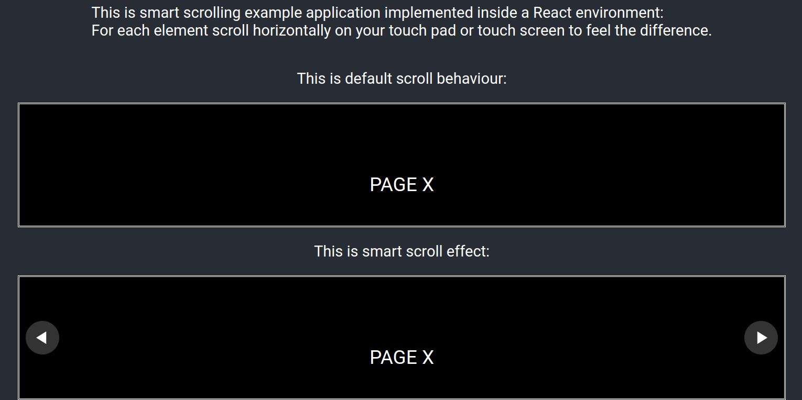

# smart_scrolling
## Description
- A generic light weight and smart horizontal scrolling function, supports button scrolling and touch scrolling.
- When scrolling an horizontal overflow element in a html page, this function going to figure out how many pages the element contains, where the size of the page is the element offsetwidth, and scrolling back and forward going to switch between pages.
- Scrolling with button clicking and screen touching is synchronized.
- Particular cases where number of pages is a float not an integer, which leads to an incomplete page at the last page, is supported.
## Example running
An example of React application implementing the smart sroll function is provided to give you an idea on how it can be used. To see how it works please follow this steps:
```
cd smart_scrolling
cd Example
npm install react-scripts
npm start
```

Executing this command will open a html page like the image below and now it's up to you to enjoy scrolling :)


